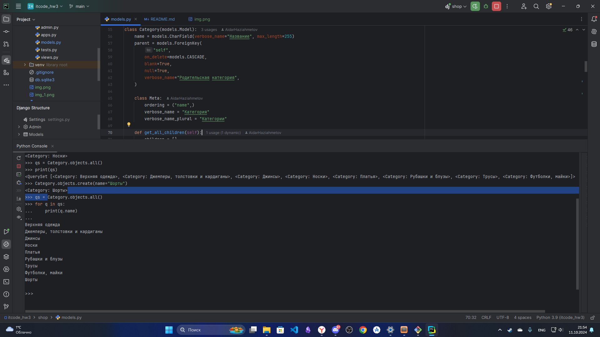

# Home work 6
#### Фильтр по названию и описанию

#### Фильтр по цене

#### Фильтр по наличию

#### Фильтр по названию и описанию v2

#### Фильтр по категориям

# hw4
`Python 3.12.4`
## Задание 1
#### Добавил категорию Джинсы и вывел все категории

#### Добавил категорию Носки и вывел все категории

#### Добавил категорию Шорты и вывел все категории

## Задание 2
### filter
#### Фильтр по цене <= 2500

#### Фильтр по цене >= 2500

#### Фильтр товаров содержащих категорию "Футболки, майки"  

### exclude
#### Исключаем товары дороже или равные 2000

#### Исключаем товары дешевле или равные 3000

#### Исключаем товары категории "Футболки, майки"

### order_by
#### Сортировка по цене по возрастанию

#### Сортировка по цене по убыванию

#### Сортировка по алфавиту в обратном порядке

### Пример сложного запроса
#### Товары дороже 2000 не из категории "Футболки, майки" отсортированные по убыванию цены

## Задание 3

#### Заказы сделанные пользователем Aidar

#### Заказы сделанные всеми кроме пользователя Damir

#### Пользователи у которых в профиле есть аватар

### values()
#### Заказы сделанные пользователем Aidar

#### Заказы сделанные всеми кроме пользователя Damir

#### Пользователи у которых в профиле есть аватар

### values_list()
#### Заказы сделанные пользователем Aidar

#### Заказы сделанные всеми кроме пользователя Damir

#### Пользователи у которых в профиле есть аватар

## Задание 4
### AND
#### Цена от 2000 до 4000

#### В наличии больше 10 и цена меньше 4000

#### В наличии больше 20 и нет описания

### OR
#### Заказы от пользователей Aidar и Rina

#### Товары не из категорий Платья и Трусы

#### Товары из категорий Платья и Трусы

### and & or
#### Товары не из категории Платья в наличии с ценой от 2000 до 5000

#### Товары из категорий "Футболки, майки" или "Рубашки и блузы" исключая товары кол-во которых < 5 или > 50  

#### Товары из категорий "Футболки, майки" или "Рубашки и блузы" исключая товары цена которых < 2000 или > 5000

## Задание 5
### annotate
#### Катерогия и цена самого дорогого товара в категории

#### Катерогия и цена самого дешевого товара в категории

#### Катерогия и средняя цена товара в категории

### aggregate
#### Максимальная цена товара во всех категориях

#### Средняя цена товара во всех категориях

#### Минимальная цена товара во всех категориях
